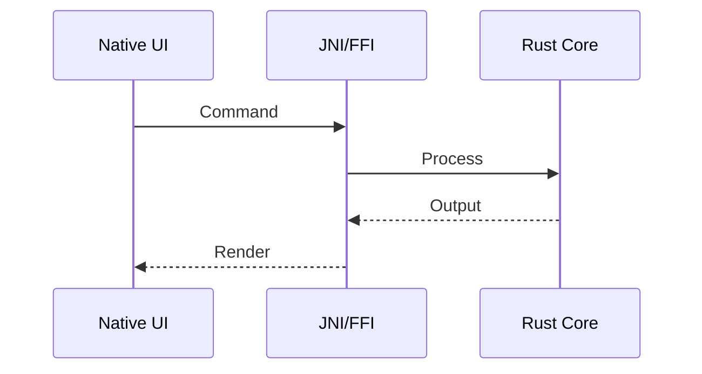

#  Flux AI Terminal
### *Redefining Mobile Development with Native Rust & Local Intelligence*

---

## 🌍 Global Documentation / 全球文档
[English](#english) | [中文](#chinese) | [日本語](#japanese) | [한국어](#korean) | [العربية](#arabic) | [Español](#spanish)

---

## 🇺🇸 English Documentation
**Flux AI Terminal** is a professional-grade mobile developer workstation. It combines a high-performance **Rust Engine**, **Native Linux Emulation**, and **Local AI (RAG)** to provide a desktop-class experience on Android and iOS.

### 🚀 Key Features
- **Security:** AES-256-GCM + Biometric Auth.
- **Performance:** Async Rust Core with zero latency.
- **Packages:** Native `apt/dpkg` package management.
- **AI:** Local offline LLM inference (Llama.cpp).

---

## 🇨🇳 中文文档 (Mandarin)
**Flux AI Terminal** 是一款专业级的移动端开发工作站。它结合了高性能的 **Rust 引擎**、**原生 Linux 仿真** 和 **本地 AI (RAG)**，在 Android 和 iOS 上提供桌面级的体验。

### 🚀 核心功能
- **安全:** AES-256-GCM + 生物识别身份验证。
- **性能:** 零延迟的异步 Rust 核心。
- **软件包:** 原生 `apt/dpkg` 软件包管理。
- **AI:** 本地离线 LLM 推理 (Llama.cpp)。

---

## 🇯🇵 日本語ドキュメント (Japanese)
**Flux AI Terminal** は、プロフェッショナル向けのモバイル開発者用ワークステーションです。高性能な **Rust エンジン**、**ネイティブ Linux エミュレーション**、および **ローカル AI (RAG)** を組み合わせ、Android および iOS 上でデスクトップ級の体験を提供します。

### 🚀 主な機能
- **セキュリティ:** AES-256-GCM + 生体認証。
- **パフォーマンス:** 遅延ゼロの非同期 Rust コア。
- **パッケージ:** ネイティブな `apt/dpkg` パッケージ管理。
- **AI:** ローカルオフライン LLM 推論 (Llama.cpp)。

---

## 🇰🇷 한국어 문서 (Korean)
**Flux AI Terminal**은 전문 모바일 개발자용 워크스테이션입니다. 고성능 **Rust 엔진**, **네이티브 리눅스 에뮬레이션**, **로컬 AI (RAG)**를 결합하여 Android 및 iOS에서 데스크톱 급의 경험을 제공합니다.

### 🚀 주요 기능
- **보안:** AES-256-GCM + 생체 인식 인증.
- **성능:** 지연 없는 비동기 Rust 코어.
- **패키지:** 네이티브 `apt/dpkg` 패키지 관리.
- **AI:** 로컬 오프라인 LLM 추론 (Llama.cpp)。

---

## 🇸🇦 وثائق باللغة العربية (Arabic)
**Flux AI Terminal** هي محطة عمل احترافية لمطوري الهاتف المحمول. فهي تجمع بين محرك **Rust** عالي الأداء، ومحاكاة **Linux الأصلية**، و**الذكاء الاصطناعي المحلي (RAG)** لتوفير تجربة من فئة سطح المكتب على أنظمة Android و iOS.

### 🚀 الميزات الرئيسية
- **الأمان:** تشفير AES-256-GCM + المصادقة البيومترية.
- **الأداء:** نواة Rust غير متزامنة مع زمن وصول صفري.
- **الحزم:** إدارة حزم `apt/dpkg` الأصلية.
- **الذكاء الاصطناعي:** استدلال LLM محلي غير متصل بالإنترنت (Llama.cpp).

---

## 🇪🇸 Documentación en Español (Spanish)
**Flux AI Terminal** es una estación de trabajo profesional para desarrolladores móviles. Combina un motor de **Rust** de alto rendimiento, emulación de **Linux nativo** e **IA local (RAG)** para proporcionar una experiencia de escritorio en Android e iOS.

### 🚀 Características Principales
- **Seguridad:** AES-256-GCM + Autenticación Biométrica.
- **Rendimiento:** Núcleo de Rust asíncrono con latencia cero.
- **Paquetes:** Gestión de paquetes `apt/dpkg` nativa.
- **IA:** Inferencia de LLM local sin conexión (Llama.cpp).

---

## 🏗️ Technical Workflow (Global)

## 👤 Author
**Muhammad Lutfi Muzaki Dev**  
*Lead Architect & AI Systems Engineer*
