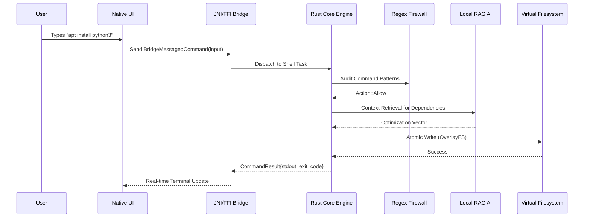
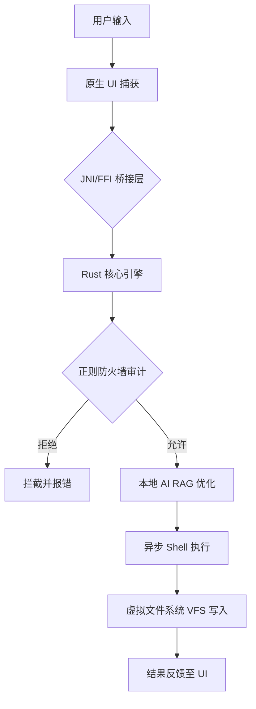

#  Flux AI Terminal
### *Redefining Mobile Development with Native Rust & Local Intelligence*
### *通过原生 Rust 和本地智能重新定义移动开发*

---

## 🌍 Language / 语言
[English](#english-documentation) | [中文 (Mandarin)](#中文文档)

---

## 🚀 English Documentation

### 🎯 Our Mission
**Flux AI Terminal** is an extreme high-performance mobile developer workstation designed to bridge the gap between desktop-class development and mobile portability. By leveraging the safety of **Rust**, the power of **Native Linux Emulation**, and the intelligence of **Local AI (RAG)**, Flux creates a zero-compromise environment for the next generation of developers.

### 🏗️ Complex System Architecture & Workflow
Flux operates on a **Decoupled Triple-Layer Architecture**:

1.  **Native Interface Layer (Kotlin/Swift):** GPU-accelerated UI that handles high-frequency terminal rendering.
2.  **JNI/FFI High-Speed Bridge:** A JSON-serialized communication channel with ultra-low overhead.
3.  **Rust Core Engine (The Brain):** An async, non-blocking kernel that manages the virtual filesystem, security firewall, and AI inference.

#### 🔄 Detailed Execution Alur (Flow)

### 📦 Core Package Ecosystem
| Category | Technology | Capabilities |
| :--- | :--- | :--- |
| **Runtime** | Node.js, Python, Rust, Go | Native Execution |
| **Security** | AES-256-GCM | Hardware-backed Biometric Enclave |
| **AI** | Llama.cpp / GGUF | Local Offline Inference |
| **Storage** | OverlayFS / EXT4 | Full RootFS Isolation |

---

## 🚀 中文文档 (Mandarin)

### 🎯 我们的使命
**Flux AI Terminal** 是一款极高性能的移动端开发工作站，旨在弥合桌面级开发与移动端便携性之间的差距。通过结合 **Rust** 的安全性、**原生 Linux 仿真** 的强大功能以及 **本地 AI (RAG)** 的智能化，Flux 为新一代开发者创造了一个零妥协的开发环境。

### 🏗️ 复杂系统架构与工作流程
Flux 基于 **解耦三层架构** 运行：

1.  **原生界面层 (Kotlin/Swift):** GPU 加速的 UI，处理高频终端渲染。
2.  **JNI/FFI 高速桥接:** 具有极低开销的 JSON 序列化通信通道。
3.  **Rust 核心引擎 (大脑):** 异步、非阻塞内核，管理虚拟文件系统、安全防火墙和 AI 推理。

#### 🔄 详细执行流程 (Alur)

### 💎 核心功能特性
- **🛡️ 分层安全模型:** 使用 AES-256-GCM 加密存储，并绑定硬件级生物识别。
- **🧠 本地 AI 引擎:** 集成 470MB+ 本地知识库，支持 RAG 增强生成，完全离线运行。
- **📦 原生包管理器:** 完整的 `dpkg/apt` 支持，具备依赖关系拓扑排序功能。
- **🖥️ Wayland GUI:** 支持在移动端直接运行 Linux 图形化界面程序。

---

## 📅 Project Roadmap / 项目路线图
- [x] **Phase 1:** Rust Core & Security (Completed) / 核心与安全 (已完成)
- [ ] **Phase 2:** GPU Acceleration & Wayland (Q3 2026) / GPU 加速与图形支持 (2026 Q3)
- [ ] **Phase 3:** Cloud Sync & Plugin Store (Q4 2026) / 云端同步与插件市场 (2026 Q4)

---

## 👤 Author / 作者
**Muhammad Lutfi Muzaki Dev**  
*Lead Architect & AI Systems Engineer*

## 📄 License / 许可证
MIT License. Copyright (c) 2026 Flux AI Team.
