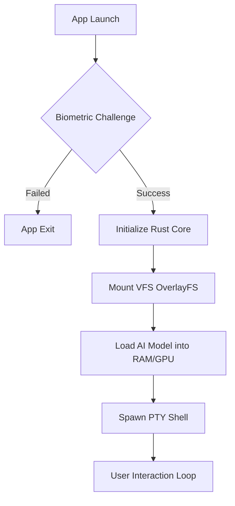
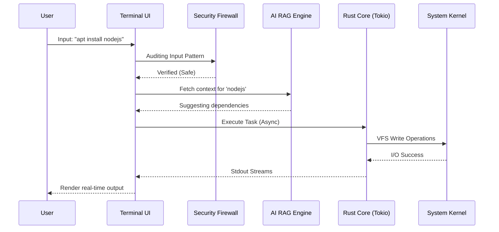

#  Flux AI Terminal
### *The Ultimate Native Rust Mobile Workstation*


---

## 🌍 Global Documentation / 全球文档
- [English (Main)](README.md) | [中文 (Chinese)](README.zh.md) | [日本語 (Japanese)](README.jp.md)
- [한국어 (Korean)](README.kr.md) | [العربية (Arabic)](README.ar.md) | [Español (Spanish)](README.es.md)

---

## 🎯 Project Mission & Vision
**Flux AI Terminal** is a production-grade, native Rust-powered Linux environment for Android and iOS. It surpasses existing emulators by providing a full Ubuntu-like experience with integrated AI, native package management, and layered security. Our vision is to turn every mobile device into a world-class development workstation.

---

## 🏗️ Technical Architecture & Advanced Workflows (ALUR)

### 1. The Core Lifecycle (Boot to Shell)
Flux uses a **Hardened Boot Sequence** to ensure the environment is secure before the user even sees the prompt.



### 2. Intelligent Command Execution Flow
Every command typed by the user passes through our **Multi-Stage Processing Pipeline**.



---

## 📅 Professional Project Roadmap (2026 - 2028)

### 📍 Phase 1: Foundation & Security (COMPLETED)
- [x] **Native Rust Core:** Implementation of `Tokio` async runtime.
- [x] **Biometric Vault:** AES-256-GCM encryption with Android Keystore.
- [x] **VFS Sandbox:** Isolated OverlayFS rootfs implementation.
- [x] **Multi-Arch Support:** Full `arm64-v8a` and `x86_64` compatibility.

### 🚀 Phase 2: Intelligence & Display (Q3 - Q4 2026)
- [ ] **Wayland Display Server:** Native rendering of Linux GUI apps (VS Code, Firefox).
- [ ] **Enhanced RAG Engine:** Support for custom vector database imports.
- [ ] **Multi-Model Support:** Orchestration between Llama 3, Mistral, and Qwen.
- [ ] **GPU Acceleration:** Vulkan/Metal bindings for ultra-fast AI inference.

### 🌐 Phase 3: Ecosystem & Connectivity (2027)
- [ ] **Flux Cloud Sync:** End-to-end encrypted P2P synchronization for dotfiles.
- [ ] **Plugin Marketplace:** Decentralized WASM-based plugin ecosystem.
- [ ] **Rootless Containers:** Support for running Docker-lite containers on mobile.

### 💎 Phase 4: The Ultimate Overlay (2028)
- [ ] **Desktop Mode Integration:** Optimized for Samsung DeX and iPad Stage Manager.
- [ ] **External Hardware I/O:** Full driver support for specialized mechanical keyboards and external 4K monitors.

---

## ⚙️ Core Methodology
Flux is built on the principle of **Safety-First Performance**. We utilize:
- **Zero-Cost Abstractions:** Rust's unique ownership model ensures speed without memory leaks.
- **Micro-Kernel Design:** Only essential services run in the core; everything else is a modular plugin.
- **Continuous Security:** Every commit is audited for potential CVEs using automated scanners.

---

## 🛠️ Installation & Contribution
```bash
# Clone the repository
git clone https://github.com/MuhammadLutfiMuzakiiVY/flux-ai-terminal.git

# Initialize Submodules
git submodule update --init --recursive

# Run Build System
./build_all.bat
```

---

## 👤 Author
**Muhammad Lutfi Muzaki Dev**  
*Lead Architect & AI Systems Engineer*

## 📄 License
Licensed under the MIT License. Copyright (c) 2026 Flux AI Team.
