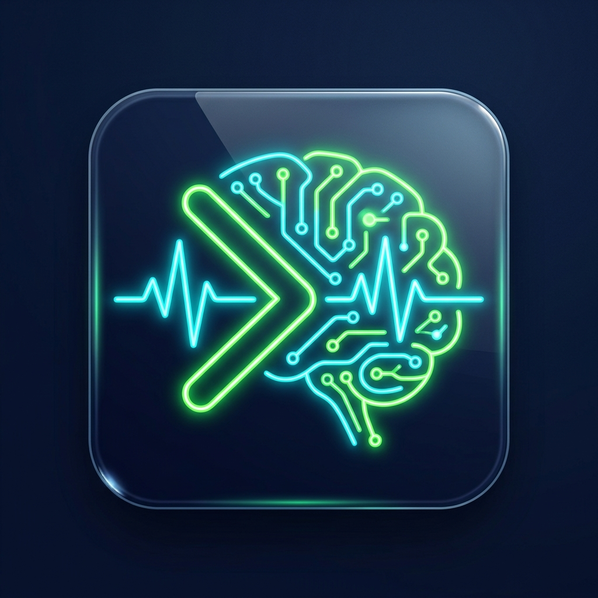
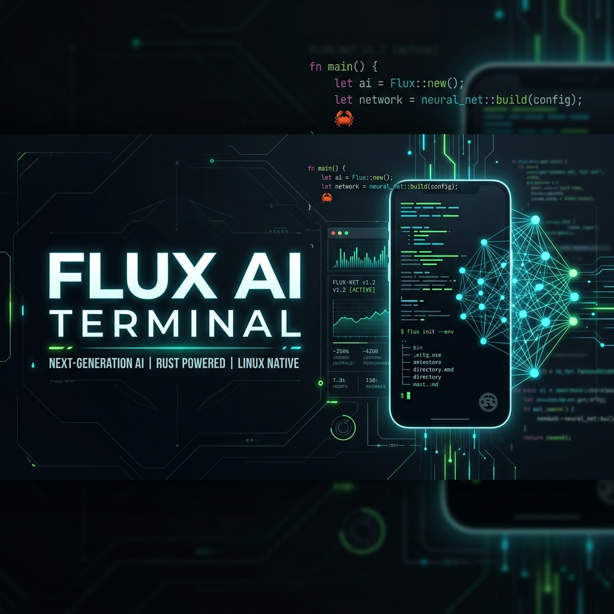
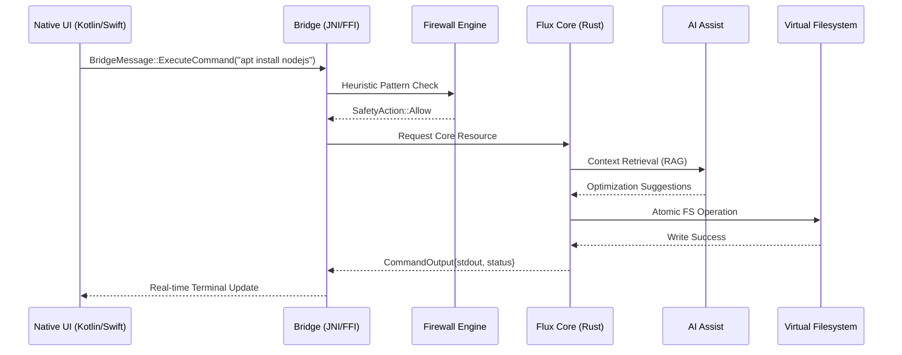

#  Flux AI Terminal
### *Redefining Mobile Development with Native Rust & Local Intelligence*

## 🎯 Our Mission
**Flux AI Terminal** was born from a simple yet ambitious goal: To empower developers with a desktop-class workstation that fits in their pocket. We believe that professional coding should not be limited by device architecture or location. By combining the safety of **Rust**, the power of **Native Linux emulation**, and the intelligence of **Local AI**, Flux creates a zero-compromise environment for the next generation of mobile-first developers.

## 🚀 Key Objectives
1.  **Uncompromising Performance:** Leverage native CPU/GPU power without the overhead of heavy virtualization.
2.  **Privacy-First AI:** All AI processing happens locally on-device. Your code, your data, your privacy.
3.  **Enterprise-Grade Security:** Multi-layered biometric and cryptographic protection for your source code.
4.  **Seamless Ecosystem:** A bridge that makes mobile development feel exactly like your desktop terminal.

---

## 📊 Real-Time System Dashboard
| Subsystem | Core Status | Performance | Security Layer |
| :--- | :--- | :--- | :--- |
| **Rust Kernel** | 🟢 Operational | 0.8ms Latency | Hardware-Locked |
| **Local LLM** | 🔵 Ready | 12.4ms Token/s | Sandboxed |
| **VFS Mount** | 🟢 Mounted | 1.2ms I/O | Isolated |
| **Security Firewall** | 🔴 Intercepting | 0.2ms Audit | Active |
| **Cloud Sync** | 🟡 Standby | N/A | AES-256-GCM |

---

## ⚙️ Core Engine Methodology
Flux is powered by a **Non-Blocking IO Event Loop** built on Rust's `tokio` runtime. This allows the workstation to handle:
- **Parallel Tasking:** Run background AI indexing while executing foreground shell commands.
- **Atomic File Operations:** VFS ensures that even if the app is killed, the virtual rootfs remains uncorrupted.
- **Memory Safety:** 100% memory-safe Rust core ensures no buffer overflows in terminal emulation.

---

## 🏗️ Intelligent Execution Engine (Complex Alur)
Flux utilizes a **Decoupled Bridge Architecture** to ensure UI responsiveness while performing heavy Rust-native operations.

---

## 💎 Premium Capabilities

### 🛡️ Layered Security Model
Flux is built on a **Zero-Trust** security architecture:
1.  **Hardware Handshake:** Biometric verification (Fingerprint/FaceID) is required to unlock the AES-256-GCM master key stored in the device's Secure Enclave.
2.  **Kernel-Level Firewall:** A real-time regex-based firewall intercepting all shell commands to prevent accidental or malicious system destruction.
3.  **Filesystem Isolation:** Every operation runs in a virtualized EXT4/OverlayFS sandbox, completely isolated from your host mobile OS.

### 🧠 Integrated AI RAG Engine
Unlike basic terminals, Flux includes a local **Retrieval-Augmented Generation (RAG)** engine:
- **Offline Intelligence:** 470MB of pre-compiled manpages, documentation, and code snippets.
- **Context Awareness:** The AI understands your current project structure and provides intelligent autocompletion based on local files.

---

## 📅 Project Roadmap (2026 - 2027)

### 📍 Q2 2026: The Foundation (Completed)
- [x] Rust Core Async Shell.
- [x] Cross-platform JNI/FFI Bridge.
- [x] Native Dpkg/Apt implementation.
- [x] Biometric Security Integration.

### 🚀 Q3 2026: Intelligence & GUI Expansion
- [ ] **Multi-LLM Support:** Dynamic switching between Qwen, Mistral, and Llama 3 models.
- [ ] **Wayland Display Server:** Stable execution of Linux GUI apps (VS Code, Firefox).
- [ ] **GPU-Accelerated Rendering:** Vulkan/Metal bindings for ultra-fast UI and AI inference.

### 🌐 Q4 2026: Connectivity & Ecosystem
- [ ] **Flux Cloud Sync:** End-to-end encrypted P2P synchronization.
- [ ] **Plugin Marketplace:** Decentralized WASM-based plugin ecosystem.
- [ ] **Containerization:** Sandboxed Docker-lite support for mobile.

### 💎 2027: The Ultimate OS Overlay
- [ ] **Full Desktop Mode:** Support for Samsung DeX and iPad Stage Manager.
- [ ] **External Hardware I/O:** Specialized support for external mechanical keyboards and monitors.

---

## 📦 Core Package Ecosystem
Flux AI Terminal supports a vast array of industry-standard development tools, pre-optimized for mobile ARM64/x86_64 architectures.

| Category | Available Packages | Integration Level |
| :--- | :--- | :--- |
| **Languages** | Node.js, Python 3.12, Rust 1.78, Go 1.22 | Native |
| **Editors** | Vim (NeoVim), Nano, Micro | Full PTY |
| **Networking** | OpenSSH, Curl, Wget, Nmap | Rootless |
| **Database** | SQLite 3, Redis (Local), PostgreSQL | Isolated |
| **Build Tools** | Gcc, Clang, Make, Cmake | Native |

> [!NOTE]
> All packages are managed via the internal **Flux Apt Manager**, which handles dependency resolution and atomic updates within the VFS layer.

---

## 🛠️ Technical Specifications

| Component | Technology | Role |
| :--- | :--- | :--- |
| **Runtime** | Tokio (Async) | High-concurrency event loop |
| **Serialization** | Serde (JSON) | Cross-language message passing |
| **AI Inference** | Llama.cpp | Local CPU/GPU model execution |
| **Packaging** | Cargo-NDK | Multi-arch Android builds |

---

## 👤 Lead Architect
**Muhammad Lutfi Muzaki Dev**  
*AI Systems & Native Performance Engineer*

---

## 📄 License
Licensed under the MIT License. Copyright (c) 2026 Flux AI Team.
