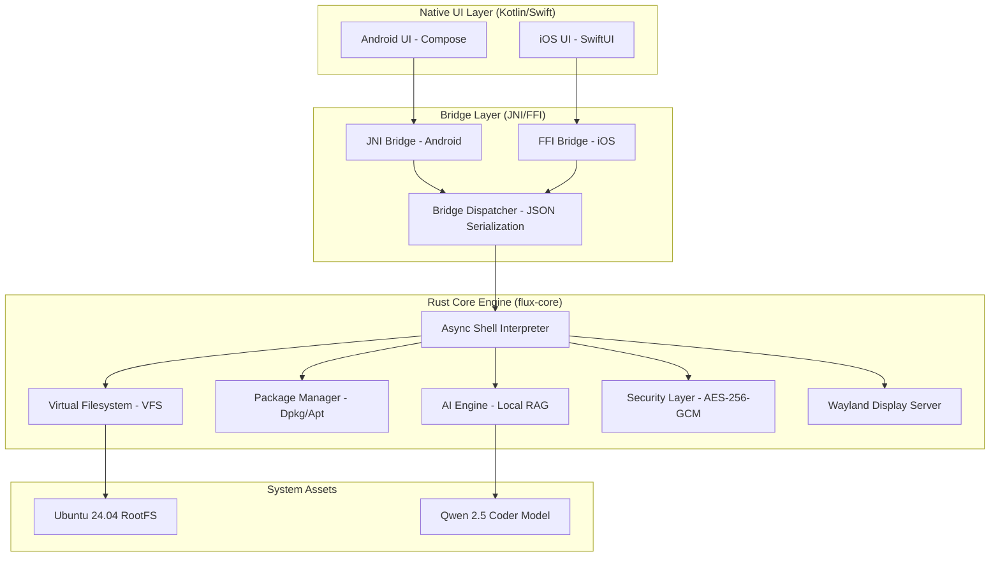

# 🏗️ Flux AI Terminal: System Architecture
## *Extreme High-Performance Mobile Workstation*

This document outlines the multi-layered architecture of Flux AI Terminal, designed for zero-latency, high security, and cross-platform native performance.

---

## 🗺️ High-Level System Map

---

### 🛡️ Layer 1: Security Architecture (Zero-Trust)
Flux implements a hardware-backed security model:
- **Biometric Handshake:** Upon app start, the `Native UI` requests a biometric token.
- **Keychain Unlock:** The token is passed to `security::keychain`, which unlocks the master AES key.
- **Sealed Vault:** The `EncryptedVault` stays in an opaque state until decrypted in memory.
- **Shell Firewall:** Every command is intercepted by `firewall::CommandFirewall` before parsing.

### 🐚 Layer 2: Execution Engine
- **Async Recursion:** The shell uses `BoxFuture` for deep-stack command pipelines without memory overflow.
- **PTY Emulation:** Provides a full terminal-ready pseudo-terminal for interactive programs (vim, nano, htop).
- **Process Management:** Tracks virtual PIDs and signals within the sandboxed environment.

### 🧠 Layer 3: AI Intelligence
- **Local RAG:** Uses a vector database stored in `assets/data/` for local context.
- **LLM Integration:** Direct binding to `llama.cpp` for ultra-fast local inference on mobile NPUs.
- **Autocomplete:** 20MB of pre-compiled command patterns for instant suggestion.

### 🖥️ Layer 4: GUI Subsystem
- **Wayland Integration:** Implements a minimal Wayland compositor in Rust.
- **Surface Rendering:** Surfaces are rendered to `SurfaceView` (Android) or `CALayer` (iOS) via shared memory.

---

## 📦 Data & Memory Flow
1. **Input:** User types a command in the Native UI.
2. **Bridge:** The UI serializes the command into a `BridgeMessage::ExecuteCommand`.
3. **Engine:** Flux Core receives the message, runs it through the Firewall, and parses the command.
4. **Execution:** The command interacts with the VFS or Package Manager.
5. **Output:** Real-time stdout/stderr streams are serialized back to the UI for rendering.

---

## 🛠️ Build Strategy
Flux uses a **Unified Source, Native Binary** strategy:
- **Core:** Compiled to `.so` (Android) and `.a` (iOS).
- **Assets:** Bundled as raw assets in APK/IPA or downloaded on first run via the Sync Manager.
